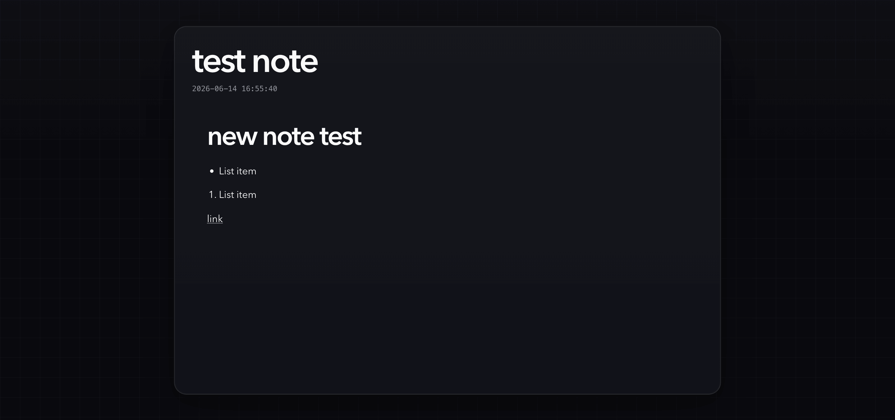
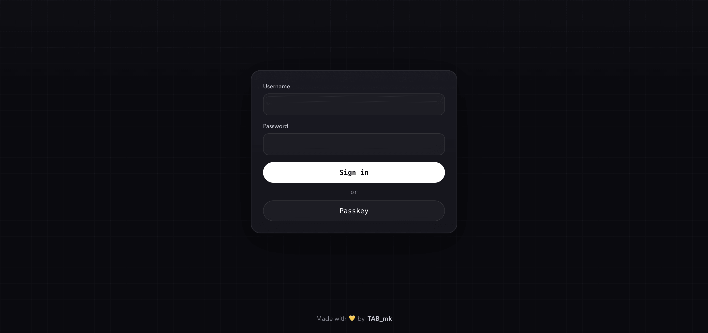
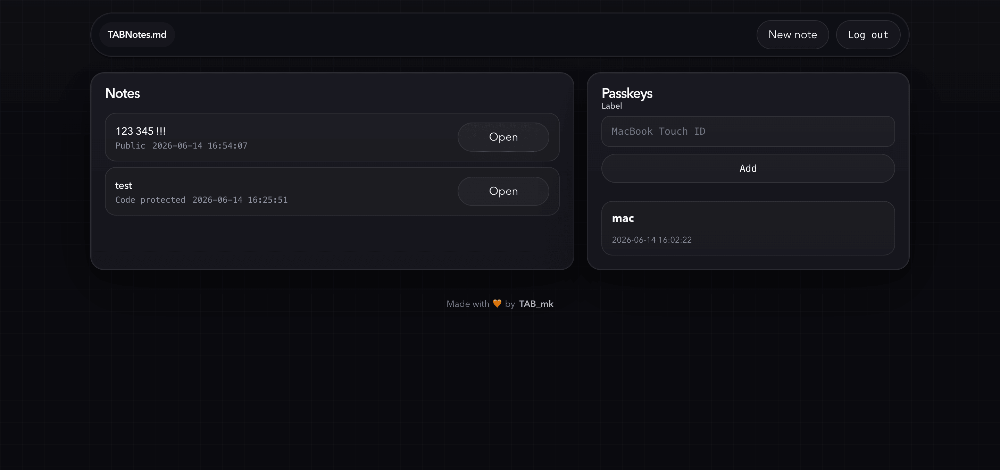
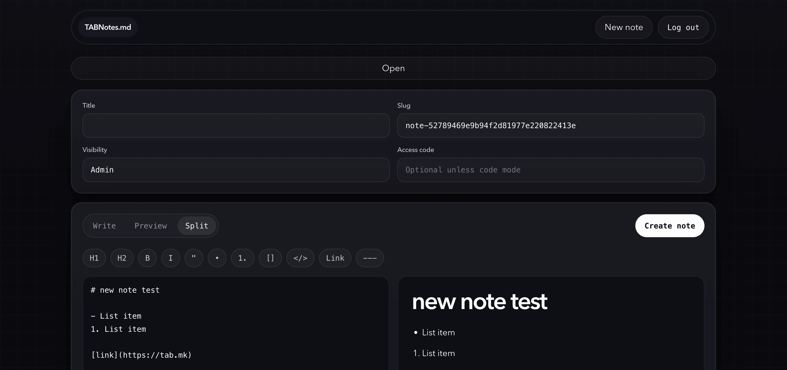
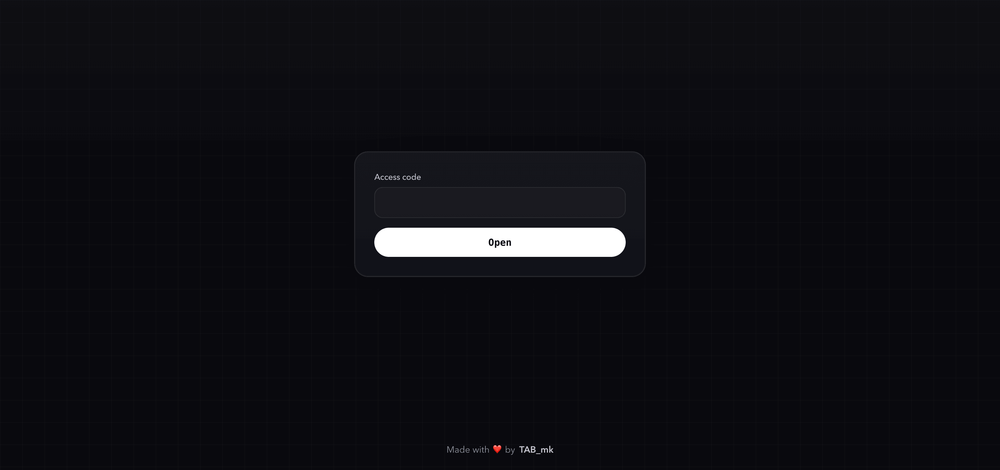

__Help__ [](https://github.com/TABmk/TABNotes.md/issues?q=is%3Aopen+is%3Aissue) [](https://github.com/TABmk/TABNotes.md/pulls?q=is%3Aopen+is%3Apr)

__Rate__ [](https://github.com/TABmk/TABNotes.md)

# TABNotes.md

<p align="center">
  
</p>

TabNotes is a lightweight self-hosted Markdown notes service written in Rust.

It has a single admin account from environment variables, SQLite storage, rendered shared pages, optional passkey login, and a minimal dashboard for creating and editing notes.

## Features

- no self-registration flow
- admin can register passkeys after signing in
- minimal dashboard with note list, editing, and deletion
- API key management in the dashboard for scripted note access
- `/` redirects to `ROOT_REDIRECT_URL`
- notes use Markdown with live rendered preview while editing
- shared links open as rendered Markdown pages
- note visibility modes:
  - `admin`: requires admin session and redirects to `/login` if missing
  - `public`: open to anyone, with `noindex`
  - `code`: prompts for a note code before showing the rendered note
- SQLite database
- Dockerfile and `docker-compose.yml` included

## Screenshots

<p align="center" width="100%">
  
  
</p>
<p align="center" width="100%">
  
  
</p>

## Environment variables

| Variable | Required | Default | Description |
| --- | --- | --- | --- |
| `ADMIN_USERNAME` | yes | - | Admin login username |
| `ADMIN_PASSWORD` | yes | - | Admin login password |
| `BIND_ADDR` | no | `0.0.0.0:8080` | Listen address inside the container or host |
| `DATABASE_URL` | no | `sqlite://data/tabnotes.db` | SQLite connection string |
| `ROOT_REDIRECT_URL` | no | `/dashboard` | URL used when someone opens `/` |
| `PUBLIC_BASE_URL` | yes | - | Public base URL used for passkeys and shared links |
| `PASSKEY_RP_NAME` | no | `TabNotes` | WebAuthn relying-party display name |
| `HIDE_FOOTER` | no | `false` | Set to `true` to hide the `Made with ... by TAB_mk` footer |
| `RUST_LOG` | no | `info` | Rust log filter |

## Important passkey note

Passkeys require a secure origin. In practice that means:

- `https://your-domain.example`
- `http://localhost` for local development only

If you run this only on an internal Docker network, passkeys still need to be used from a browser that reaches the app through a valid secure origin.

## Local run

```bash
export ADMIN_USERNAME=admin
export ADMIN_PASSWORD='change-this'
export PUBLIC_BASE_URL='http://localhost:8080'
export ROOT_REDIRECT_URL='/dashboard'

cargo run
```

Then open `http://localhost:8080/login`.

## Docker Compose

The included `docker-compose.yml` is set up for internal Docker networking by default through `expose`.
It uses a Docker named volume for SQLite storage so you do not hit host bind-mount permission issues with the non-root container user.

Example:

```bash
cat > .env <<'EOF'
ADMIN_USERNAME=admin
ADMIN_PASSWORD=change-this-now
PUBLIC_BASE_URL=https://notes.example.com
ROOT_REDIRECT_URL=/dashboard
DATABASE_URL=sqlite://data/tabnotes.db
BIND_ADDR=0.0.0.0:8080
PASSKEY_RP_NAME=TabNotes
HIDE_FOOTER=false
RUST_LOG=info
EOF

docker compose up -d --build
```

If you specifically want a host bind mount like `./data:/app/data`, create the directory and make it writable by container UID `10001` first:

```bash
mkdir -p data
sudo chown -R 10001:10001 data
```

If you want to publish a host port, add this to the service:

```yaml
ports:
  - "8080:8080"
```

If you change or remove environment variables in Docker, recreate the container. A plain restart keeps the old container environment.

```bash
docker compose up -d --build --force-recreate
```

## docker run

```bash
docker build -t tabnotes .

docker run -d \
  --name tabnotes \
  --restart unless-stopped \
  -e ADMIN_USERNAME=admin \
  -e ADMIN_PASSWORD='change-this-now' \
  -e PUBLIC_BASE_URL='https://notes.example.com' \
  -e ROOT_REDIRECT_URL='/dashboard' \
  -e DATABASE_URL='sqlite://data/tabnotes.db' \
  -e BIND_ADDR='0.0.0.0:8080' \
  -e PASSKEY_RP_NAME='TabNotes' \
  -e HIDE_FOOTER='false' \
  -v tabnotes_data:/app/data \
  tabnotes
```

If you need a host port:

```bash
docker run -d \
  --name tabnotes \
  -p 8080:8080 \
  -e ADMIN_USERNAME=admin \
  -e ADMIN_PASSWORD='change-this-now' \
  -e PUBLIC_BASE_URL='http://localhost:8080' \
  -v "$(pwd)/data:/app/data" \
  tabnotes
```

If you use a host bind mount with `docker run`, fix permissions first:

```bash
mkdir -p data
sudo chown -R 10001:10001 data
```

If you started the container with `docker run`, changing env vars later requires removing and creating the container again. `docker restart` does not replace its environment.

## Install guide

1. Clone or copy this project onto the machine that will run it.
2. Set `ADMIN_USERNAME`, `ADMIN_PASSWORD`, `PUBLIC_BASE_URL`, and `ROOT_REDIRECT_URL`.
3. Start it with `docker compose up -d --build` or `cargo run`.
4. Open `/login` and sign in with the configured admin credentials.
5. Add a passkey from the dashboard if you want passwordless admin login.
6. Create API keys from the dashboard if you want to manage notes over HTTP.
7. Create notes and choose `admin`, `public`, or `code` visibility.

## Routes

- `/` redirects to `ROOT_REDIRECT_URL`
- `/login` admin sign-in page
- `/dashboard` admin dashboard
- `/admin/notes/new` create note
- `/admin/notes/:id/edit` edit note
- `/admin/notes/:id/delete` delete note
- `/admin/api-keys` create API key
- `/admin/api-keys/:id/delete` delete API key
- `/api/notes` list or create notes with an API key
- `/api/notes/:id` read, update, or delete a note with an API key
- `/notes/:slug` rendered shared note page

## API usage

Create an API key from the dashboard. The raw key is shown only once, so store it immediately.

Send the key in either of these headers:

- `X-API-Key: tn_...`
- `Authorization: Bearer tn_...`

Example:

```bash
API_KEY='tn_your_key_here'

curl -H "X-API-Key: $API_KEY" http://localhost:8080/api/notes

curl -X POST http://localhost:8080/api/notes \
  -H "Authorization: Bearer $API_KEY" \
  -H 'Content-Type: application/json' \
  -d '{
    "title": "API note",
    "slug": "api-note",
    "content": "Created over HTTP",
    "visibility": "public"
  }'
```
